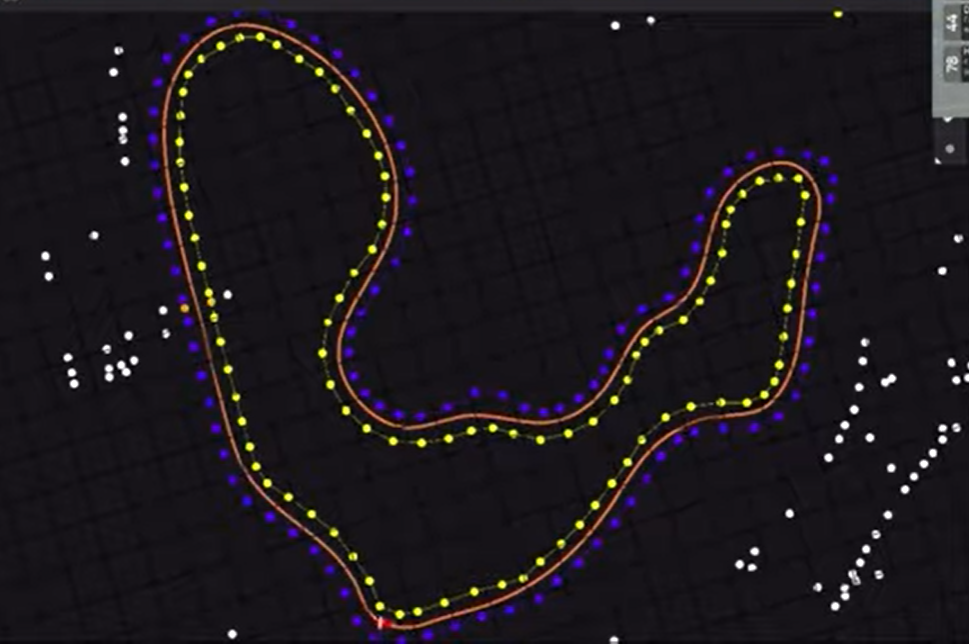
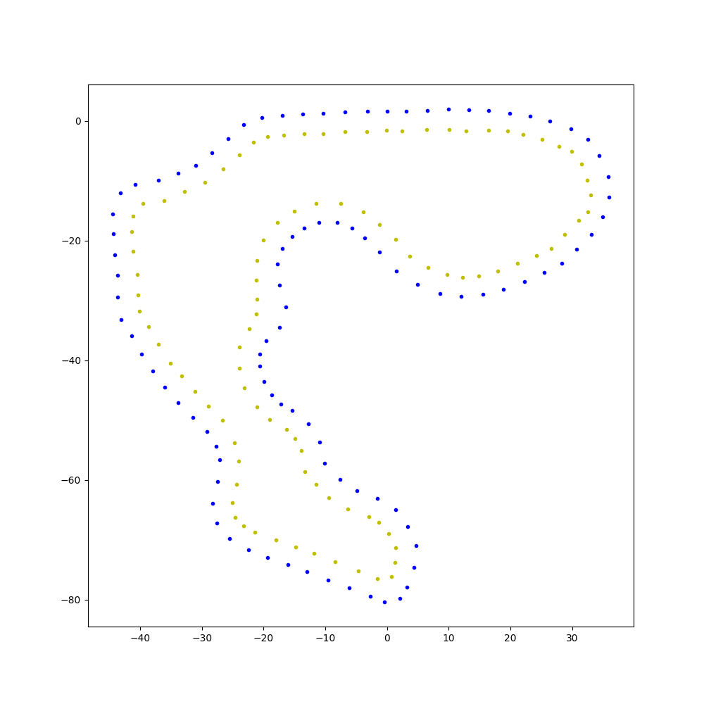

# fsg23-approximate-dv-track
Based on Starkstrom's telemetry video of their 2023 Trackdrive run at FSG, the approximate cone position are extracted in a Jupyter notebook

[This](https://www.youtube.com/watch?v=9MWKDJeAEDU) is the video this repository is based on.

If you are impatient, you can just look at the [final result](track.json).

<!-- Original image and final result side by side using table -->
<table>
    <tr>
        <th>Original image</th>
        <th>Final result</th>
  <tr>
    <td></td>
    <td></td>
  </tr>

</table>
